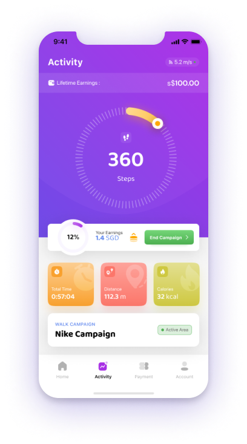

 

  </img>

<h1 align="center">$WANDER Token</h1>
<h4 align="center">The native token used in Wanderverse mobile application system</h4>

  </img>
  </img>
  </img>
  </img>

 

  </img>
  </img>
  </img>
  </img>

  </img>

# Project Status
The $WANDER token smart contract has all the necessary functions required to be classified as an upgradable ERC20 token, but incorporated with an additional layer of multi-signature requirement to conduct adminstrator functions that play significant role to the circulation of $WANDER token. Tests have been provided not just to accomodate the functions that are inside the $WANDER token smart contract, but also to test whether if upgrading the smart contract is something possible to be done. Documentations in regard to the token's smart contract details can be found in the following section (Specs). The tokenomics of the token has been established, which is discussed in $WANDER token's [whitepaper](https://wanderverseapp.gitbook.io/wander-token-whitepaper/) that is available to the public. The token smart contract has been audited by [Hacken](https://hacken.io/) and has received a full mark of 10/10, the details of the audit report can be insepected through this [link](https://hacken.io/audits/#wanderverse).

# Getting Started
The following list depicts the recommended version of different packages to run the smart contract:
- Npm: Version 8.5.5 or higher
- Node: Version 14.16.1 or higher
> **Note**
> As of 9 August 2022, solidity-coverage does not support the latest version of Truffle [(cgewecke, 2022)](https://github.com/community/community/discussions/16925), hence the use of the specific Truffle version below. 
- Truffle: 5.4.29
- Solidity Compiler: >= 0.6.12 < 0.9.0 (Wanderverse's choice: 0.8.16)
- Chai: 4.2.0 or higher
- Web3.js: 1.5.3 or higher
- Solidity-coverage: 0.7.21 or higher

# Project Structure
The development environment used to construct the smart contract is Truffle. The nature of $WANDER token's smart contract itself is inherited from existing templates, which are OpenZeppelin's [ERC20UpgradablePresetMinterPauser](https://github.com/OpenZeppelin/openzeppelin-contracts-upgradeable/blob/master/contracts/token/ERC20/presets/ERC20PresetMinterPauserUpgradeable.sol) and [Initializable](https://github.com/OpenZeppelin/openzeppelin-contracts-upgradeable/blob/master/contracts/proxy/utils/Initializable.sol). The token is to also incorporate OpenZeppelin's Upgradable ERC20 features, allowing the smart contract and essentialy the $WANDER token to be upgradable. This is done as a precautionary step towards any potential bugs/cyber attacks that can cause harm to the existing smart contract. Upgrading the token will only be done in emergency measures.